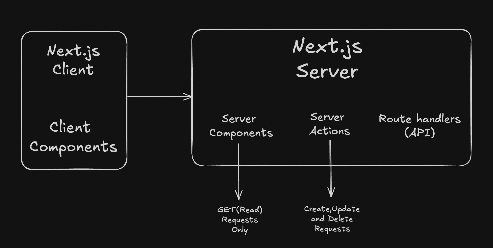

## Prisma with SQLite :

1. Install the Prisma CLI as a development dependency in the project:

```bash
npm install prisma --save-dev
```

2. Set up Prisma ORM with the init command of the Prisma CLI:

```bash
npx prisma init --datasource-provider sqlite
```

- After running the above command, a folder named `prisma` will be created in the root directory. Inside the folder `schema.prisma` file will be created where we write models(Table structure) for our application.

3. Model your data in the Prisma schema. Models in the Prisma schema have two main purposes:

- Represent the tables in the underlying database
- Serve as foundation for the generated Prisma Client API

4. To run prisma in development mode : 

```bash
npx prisma db push
```

- This command creates a file `dev.db` inside the `prisma` folder.

5. To view the created table visually(UI) :

```bash
npx prisma studio
```

6. To use the prisma we need to create an instance of prisma client. Refer `src/libs/`

### Data fetching 

- Only "GET" request can be made from within the server components. For other type of requests we need to use Server Actions.

 